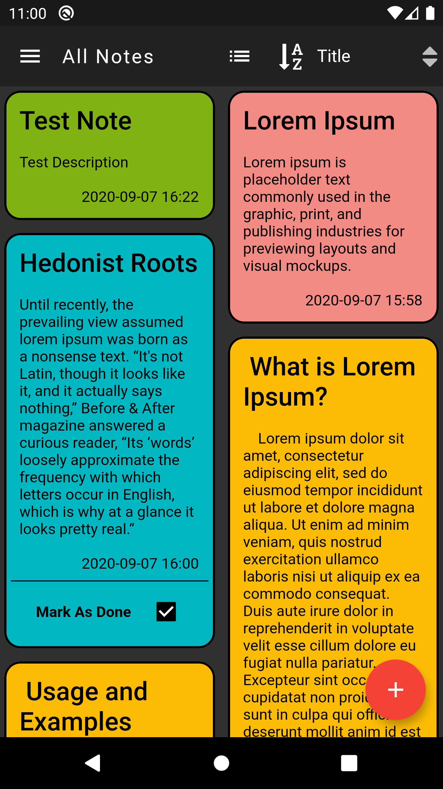
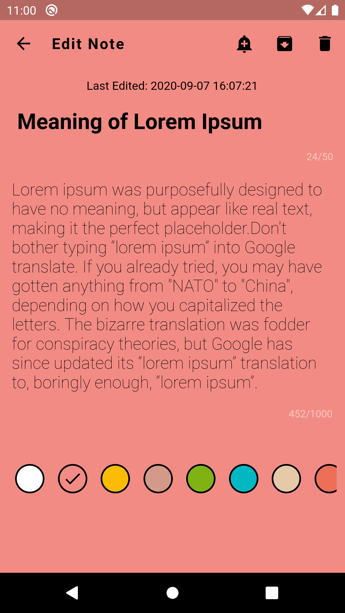
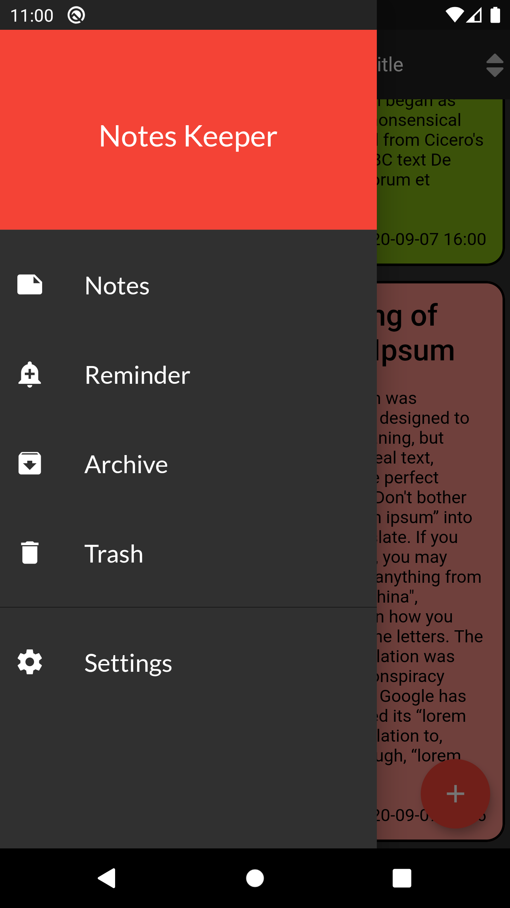

# Notes-Keeper
A Flutter App to Keep Notes
### Author: Karthik

# Screenshots
&emsp;&emsp;&emsp;&emsp;

# Features
* Simple and Good User Interface

* Dark and Light Theme

* Sort notes by title, last edit or created date

* Scheduling Note

* Notification Reminder

* Mark List as Done

* Much More...

# Third Party Libraries Used
<a href="https://pub.dev/packages/sqflite">sqflite</a>

<a href="https://pub.dev/packages/path_provider">path_provider</a>

<a href="https://pub.dev/packages/intl">intl</a>

<a href="https://pub.dev/packages/flutter_staggered_grid_view">flutter_staggered_grid_view</a>

<a href="https://pub.dev/packages/shared_preferences">shared_preferences</a>

<a href="https://pub.dev/packages/provider">provider</a>

<a href="https://pub.dev/packages/flutter_icons">flutter_icons</a>

<a href="https://pub.dev/packages/flutter_local_notifications">flutter_local_notifications</a>

<a href="https://pub.dev/packages/rxdart">rxdart</a>

<a href="https://pub.dev/packages/google_fonts">google_fonts</a>

### I'd be very happy for any feedback (especially negative) and contribution...

